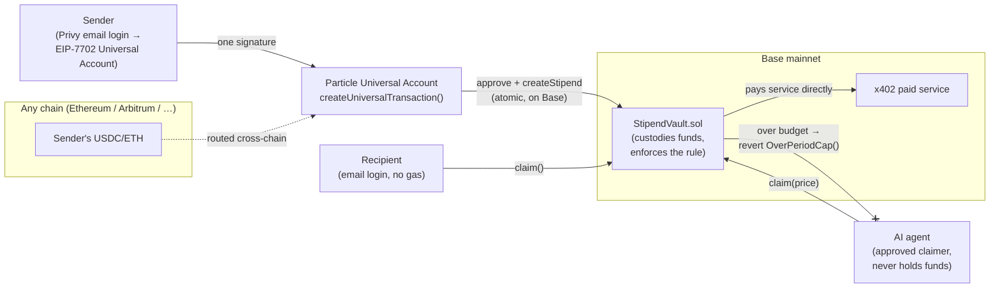

# Stipend — money with the rules built in

> **Wallet-enforced delegation, not vault-based streaming.** The rule — who gets paid, how
> much, how often, with a hard lifetime limit — is enforced by the contract that holds the
> funds, on-chain, on Base mainnet. Not by our app. Not by a keeper. Not by a bank. A
> transaction that violates the rule reverts, even if it never touches our frontend.

Stipend lets anyone set **programmable money rules** with an email address and money on any
chain: a weekly allowance for a student, a revocable subscription to a creator, or — the
headline — a **hard budget for an AI agent** that pays for services by itself and gets told
*no* by the chain when it tries to overspend.

Built for the **UXmaxx Hackathon** — Universal Accounts Track (Particle Network).

**Live demo:** `https://stipend.vercel.app` · **Contract:** `StipendVault` on Base
(`NEXT_PUBLIC_STIPEND_VAULT_ADDRESS`, address recorded after deploy) · **Demo video:** _link
in submission_

---

## The three scenes

| Scene | What happens | Why it's hard without Stipend |
|---|---|---|
| 🤖 **Agent on a budget** | An AI agent pays a 402-gated research API per call, straight from its stipend. The vault pays the service directly — the agent never holds funds. When the budget runs out, the claim **reverts on-chain** (`OverPeriodCap()`) and the service never gets paid. | Today you either give an agent your keys (unlimited) or nothing. There is no native "here's $50/week, max, enforced" primitive. |
| 🎨 **Subscriptions you control** | Recurring support for a creator that the sender can revoke in one click — the unspent balance refunds instantly. | Card subscriptions are enforced by processors; crypto "streams" lock funds in protocols with their own semantics. |
| 👨‍👧 **Allowance** | A parent funds a weekly allowance from whatever chain their money lives on; the student claims gaslessly with just an email login. | The student can never blow a month in a day — the period cap is chain law. |

## Architecture



**Where each piece of the stack earns its place:**

- **EIP-7702 (Privy `useSign7702Authorization`)** — the user's email-login EOA is upgraded
  *in place* to a Particle Universal Account. No separate "delegate" step: the authorization
  is signed inline with the first transaction and lands with it. Same address, same keys,
  reversible by the standard (an authorization to the zero address restores a plain EOA).
- **Particle Universal Accounts (7702 mode)** — the EOA *is* the UA. One signature routes
  value from wherever the sender's funds live and lands it in the vault on Base via
  `createUniversalTransaction({ chainId, expectTokens, transactions })` — the SDK sources
  USDC cross-chain and executes `approve` + `createStipend` atomically. This is the
  transfer-and-call pattern Particle's own workshop points builders at.
- **StipendVault (Solidity, Foundry, 21/21 tests)** — the enforcement core. Custody-based by
  design: the contract holds the funds, so *it does not matter what any wallet's delegation
  slot points at* — nobody can pull more than the policy allows, because the policy owner is
  the balance holder. No keeper, no off-chain watcher, nothing to bypass.
- **x402-style paid API** — the agent scene's counterparty. Answers `402 Payment Required`
  with a quote; verifies payment by reading the vault's `Claimed` event on Base. "Did I get
  paid" is a pure on-chain check.

### Why custody-based enforcement (and why we say so out loud)

EIP-7702 gives an EOA exactly **one delegation slot**, and in 7702 mode Particle's UA
implementation occupies it. Rather than fight for the slot or pretend our dApp's transaction
builder is "enforcement," Stipend moves the rule to the **asset layer**: funds sit in the
policy contract and only ever leave within the rule. The wallet stack (Privy + UA) does what
it is uniquely good at — email onboarding, in-place upgrade, one-signature cross-chain
routing — and the vault does what only a contract holding the money can do: make the rule
unbreakable.

## Contract

`contracts/src/StipendVault.sol` — deployed on Base (8453). Foundry project, OpenZeppelin
5.1, Soldeer deps, **21/21 tests** (`forge test`).

| Function | Who | What |
|---|---|---|
| `createStipend(token, recipient, amountPerPeriod, periodSeconds, totalCap, salt, initialDeposit)` | sender | Create + fund the rule (USDC or native) |
| `fund(id, amount)` | sender | Top up the pot |
| `claim(id, amount)` | recipient or approved agent | **The enforcement core** — reverts on `OverPeriodCap`, `OverTotalCap`, `InsufficientBalance`, `IsRevoked`, `NotAuthorized` |
| `revoke(id)` | sender | Kill the rule; remaining balance refunds instantly |
| `modify(id, perPeriod, periodSeconds, totalCap)` | sender | Change the rule (cannot set cap below spent) |
| `approveAgent(id, agent, approved)` | sender | Let an agent claim on the recipient's behalf |
| `available(id)` / `balanceOf(id)` / `getPolicy(id)` | anyone | Live reads the UI is built on |

## Run it locally

```bash
pnpm install
cp .env.example .env.local   # fill the values below
pnpm dev                     # → http://localhost:3000
```

| Env var | What it is |
|---|---|
| `NEXT_PUBLIC_PRIVY_APP_ID` (+ optional `NEXT_PUBLIC_PRIVY_CLIENT_ID`) | Privy app (dashboard.privy.io — email login + embedded wallets) |
| `NEXT_PUBLIC_PROJECT_ID` / `NEXT_PUBLIC_CLIENT_KEY` / `NEXT_PUBLIC_APP_ID` | Particle project credentials (dashboard.particle.network) |
| `NEXT_PUBLIC_BASE_RPC_URL` | Base mainnet RPC |
| `NEXT_PUBLIC_STIPEND_VAULT_ADDRESS` / `NEXT_PUBLIC_VAULT_DEPLOY_BLOCK` | Deployed vault + its deploy block (log recovery) |
| `NEXT_PUBLIC_USDC_ADDRESS` | USDC on Base (`0x8335…2913`) |
| `AGENT_PRIVATE_KEY` | **Server-only.** Demo agent's key (fresh throwaway, ~0.0005 ETH on Base for gas) |
| `NEXT_PUBLIC_SERVICE_ADDRESS` | Where the paid research API receives its money |

Deploy the contract (Base mainnet, costs a few cents):

```bash
cd contracts
cp .env.example .env         # PRIVATE_KEY (funded dev wallet) + BASE_RPC_URL
./deploy.ps1                 # or: forge script script/Deploy.s.sol:DeployStipendVault --rpc-url base --broadcast
```

## Demo script (90 seconds)

1. **Create** — email login → "New stipend" → $0.25/day for the research service, $1 total,
   funded with USDC sourced from Arbitrum. One signature; the route resolves cross-chain and
   the rule goes live on Base.
2. **Delegate the agent** — one click approves the agent's address on the stipend.
3. **Let it work** — the agent calls the paid API: `402 → claim $0.05 (vault pays the
   service) → 200 + data`. Repeat.
4. **The wall** — the next call would cross the cap: **`BLOCKED ON-CHAIN: OverPeriodCap()`**.
   No payment, no data, no app logic involved — the chain said no.
5. **Exit** — dashboard → *Stop & refund*. Unspent money is back with the sender in one
   transaction. (And if the user wants their plain EOA back: undelegate. Reversible by
   design.)

## Stack

Next.js 14 (App Router) · TypeScript · viem · Privy (`@privy-io/react-auth`, email OTP +
inline EIP-7702 auth) · Particle Universal Account SDK v2 (7702 mode) · Solidity 0.8.28 ·
Foundry · Base / Arbitrum / Ethereum mainnet.

## Roadmap

- **Merchant/category scoping** — v2 policies gate *what* a claim pays for, not just how much.
- **Universal Agent Accounts** — as Particle ships agent-native accounts, Stipend is the
  consumer budget layer on top: we built the MVP of the pattern before the infra shipped.
- **Everywhere 7702 goes** — the standard is spreading beyond Ethereum L2s (even
  Bitcoin-secured chains like Mezo ship type-0x04 at genesis). Wallet-enforced money rules
  port with it — BTC-backed allowances included.

---

*UXmaxx Hackathon 2026 · Universal Accounts Track · built with real funds on mainnet, no
testnets harmed.*
