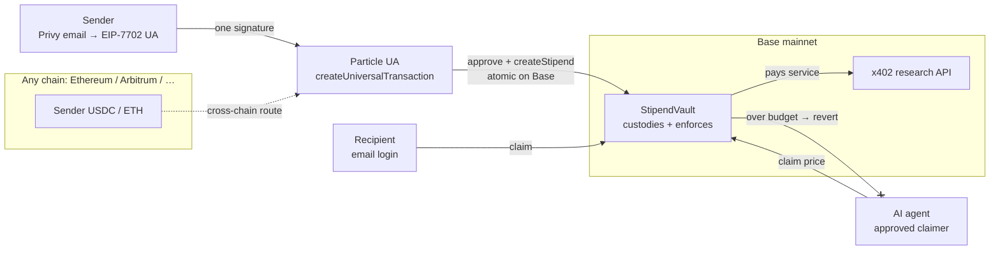

# Stipend

**Money with the rules built in.**

> **Wallet-enforced delegation, not vault-based streaming like Sablier.**
>
> **video demo** - https://youtu.be/2hGcoSqq8qk
> **concept note** - https://docs.google.com/document/d/1qPLAYDrGcONhXmquCiE8f-Ys6_8l25i5gPmeQxC9IbQ/edit?usp=sharing

Stipend turns an email wallet into a place where **spend limits actually fire**.
You set who gets paid, how much, how often, and a hard lifetime cap. Those rules
live in a contract that **holds the funds** on Base. Anything over the line
**reverts on-chain**, even if someone bypasses our UI.

No bank. No Stripe. No off-chain keeper. No soft "please don't overspend" logic.

**The layer beneath agent payments:** protocols like x402 assume something
enforces budgets. Stipend *is* that something, for humans and AI agents,
funded from any chain through Particle Universal Accounts (EIP-7702).

<p align="center">
  
</p>

| | |
|---|---|
| **Hackathon** | UXmaxx 2026 · 7702 Collective |
| **Track** | Universal Accounts (Particle), primary |
| **Live** | [stipend-five.vercel.app](https://stipend-five.vercel.app) |
| **Code** | [github.com/Demiladepy/stipend](https://github.com/Demiladepy/stipend) |
| **Contract** | [`StipendVault` on Base](https://basescan.org/address/0xf37b1def20b488a76031933d6258650fd3e9d88d) — deploy tx [`0x82da83d9…`](https://basescan.org/tx/0x82da83d985af4c211d1e750cf8f2caab594147ff288d1900c9718dd8d471b7ea) |

## ⚡ Test it yourself in 30 seconds (no wallet, no funds needed)

1. Open **[stipend-five.vercel.app/agent](https://stipend-five.vercel.app/agent)**
2. The demo stipend's rule id is prefilled. Click **"2 · Run a paid research call"**
3. Watch a real transaction land on Base mainnet: the AI agent pays the research API
   **from its stipend** — the vault pays the service directly, the agent never holds funds
4. Keep clicking. When the period budget runs out, the next call is
   **rejected by the chain itself**: `BLOCKED ON-CHAIN: OverPeriodCap()` — no payment,
   no data, no app logic involved. Every call links to Basescan.

That rejection is the product: a spending rule no app, keeper, or middleman can override.

---

## Why this wins the UA Track

Judges ask three things. We answer all three in the product:

| Judge question | Stipend answer |
|---|---|
| Is UA + 7702 *prominent*, or bolted on? | Email login → EIP-7702 Universal Account → one-signature **cross-chain fund into a rule on Base**. UA is the funding path, not a side quest. |
| Is the UX consumer-grade? | No "EOA", no "delegation", no "periodSeconds" in the UI. Plain language: who, how much, how often, hard limit. |
| What's novel vs Sablier / streams? | **Enforcement is custody.** Funds sit in `StipendVault`. Overspend **reverts on-chain**. Agent never holds keys or money. |

Tribal signals we ship to (verbatim where it matters):

- *"Asset-centric, not chain-centric"* (Derek Chiang / ZeroDev)
- *"The wallet is where spending limits actually fire"* (Joan Alavedra / Openfort)
- *"EIP-7702 is the quiet unlock"* (7702 Collective)
- *"We built the consumer MVP of Universal Agent Accounts before the infra shipped"* (Particle roadmap)

---

## The problem

Today you can:

- Give an AI agent your keys → unlimited blast radius
- Or give it nothing → it can't pay for tools

There is no native consumer primitive for: **"Here's $50/week, max $5/call, enforced, and I can revoke instantly."**

Card rails enforce that with processors. Crypto "streams" usually lock you into vault UX that judges pattern-match to Sablier and stop listening. Stipend is the **wallet-layer rule**: programmable money for people and agents, funded from any chain via Particle Universal Accounts.

---

## What we built (shipped in this repo)

### Product surfaces

| Route | What it does |
|---|---|
| `/` | Brand-first landing: pitch, how it works, three scenes with imagery |
| `/create` | Jargon-free create + **UA cross-chain fund** (transfer-and-call into vault) |
| `/dashboard` | Live policies: available / pot / lifetime left · top-up · modify · revoke+refund |
| `/claim` | Recipient view: claim without caring which chain the money came from |
| `/agent` | **Hero scene**: agent pays x402 research API; over-cap shows **BLOCKED ON-CHAIN** |
| `/api/research` | x402-style 402 → quote → verify `Claimed` event on Base |
| `/api/agent/step` | Server agent loop: simulate → claim → retry with payment proof |

<p align="center">
  
</p>
<p align="center"><em>Hero scene: an agent on a hard budget. The chain is the referee.</em></p>

### Contract: `StipendVault` (Plan B: custody enforcement)

`contracts/src/StipendVault.sol` · Solidity 0.8.28 · OpenZeppelin SafeERC20 + ReentrancyGuard · Foundry · **21/21 tests green**

| Function | Role |
|---|---|
| `createStipend` / `fund` | Create the rule and custody USDC (or native) |
| `claim` | **Enforcement core**: period cap, total cap, balance, revoke, authorization |
| `revoke` | Sender stops the rule; remainder refunds |
| `modify` | Change caps (cannot set total below spent) |
| `approveAgent` | Let an agent claim without ever holding funds |
| `available` / `balanceOf` / `getPolicy` | Live reads for the UI |

**Architecture choice (honest):** EIP-7702 gives one delegation slot; Particle's UA occupies it. We do **not** pretend our dApp is enforcement. Funds live in the vault, so a bypass of the frontend still cannot pull more than the policy allows. UA does what it uniquely does: **one-signature cross-chain routing** of deposits in (and payouts out).

### Stack that maps to prize criteria

| Layer | Choice | Why |
|---|---|---|
| Auth + 7702 | **Privy** email OTP + embedded wallet + inline `signAuthorization` | Matches Particle's own UA+7702 reference; Magic bonus dropped after paywall (same UX story) |
| Chain abstraction | **Particle Universal Account SDK v2** (`useEIP7702: true`) | `createUniversalTransaction` = transfer-and-call into vault on Base |
| Chains | **Ethereum / Arbitrum / Base mainnet** | UA Track liquidity triangle; contract on Base |
| App | Next.js 14 App Router · TypeScript · viem · ethers · Tailwind · three.js hero | Consumer polish without crypto jargon |

---

## Three demo scenes

### 1. AI agent budget (**HERO**)

<p align="center">
  
</p>

Agent gets a stipend (e.g. $50/wk, $5/call). It calls a paid research API. Vault pays the **service** directly; agent is only an approved claimer. When the next call would break the rule:

```text
BLOCKED ON-CHAIN: OverPeriodCap()
```

No payment. No data. No app soft-block. **The chain said no.**

### 2. Creator subscription

<p align="center">
  
</p>

Recurring support with an instant cut-off. Revoke → unspent balance refunds to the sender. No processor to beg.

### 3. Allowance (parent → student)

<p align="center">
  
</p>

Weekly limit that cannot be blown in a day. Fund from wherever USDC/ETH lives. Student claims with email; gas is abstracted via UA.

---

## Architecture



**Where each sponsor piece earns its keep:**

1. **EIP-7702 + Privy:** email EOA upgraded in place; inline authorizations with the UA userOps (same address, reversible).
2. **Particle UA:** sources funds from Arb/ETH and lands them in the vault on Base in one abstracted flow.
3. **StipendVault:** the moat. Caps fire here because the contract holds the money.
4. **x402-style endpoint:** payment proof is an on-chain `Claimed` event, not a database flag.

---

## 90-second demo script (for judges)

1. **Login:** email OTP (Privy). Debug panel shows EOA + UA balance.
2. **Create:** recipient = research service · small period amount · fund from unified balance · one signature · route resolves to Base.
3. **Approve agent:** one click on `/agent`.
4. **Run calls:** `402 → claim → 200 + data`. Repeat.
5. **The wall:** next call hits the cap → **BLOCKED ON-CHAIN**.
6. **Exit:** dashboard → Stop & refund. Remainder returns to sender.

---

## What's achieved

**The product is built and live end-to-end** — vault on Base, UA funding path, agent scene, and submission assets.

| Milestone | Status |
|---|---|
| Foundry `StipendVault` + **21/21 tests** | Done |
| Deploy scripts (`Deploy.s.sol`, `deploy.ps1`) | Done |
| Next.js app: create / dashboard / claim / agent / APIs | Done · builds green |
| Privy + UA SDK v2 · inline 7702 | Done · login verified live |
| Mechanic-1 UA transfer-and-call into vault | Done · implemented in `UAProvider` |
| Landing polish + scene imagery | Done |
| Live Base vault address + Arb→Base funding tx | Done |
| Submission video / deck | Done |

---

## Run locally

```bash
pnpm install
cp .env.example .env.local   # Privy + Particle + Base RPC (+ vault after deploy)
pnpm dev                     # http://localhost:3000 (or 3001 if 3000 is taken)
```

```bash
cd contracts
cp .env.example .env         # PRIVATE_KEY + BASE_RPC_URL
forge test                   # 21/21
./deploy.ps1                 # Base mainnet broadcast when wallet has gas
```

| Env | Purpose |
|---|---|
| `NEXT_PUBLIC_PRIVY_APP_ID` | Email + embedded wallets |
| `NEXT_PUBLIC_PROJECT_ID` / `CLIENT_KEY` / `APP_ID` | Particle UA |
| `NEXT_PUBLIC_STIPEND_VAULT_ADDRESS` | Vault on Base (after deploy) |
| `NEXT_PUBLIC_USDC_ADDRESS` | Base USDC `0x833589fCD6eDb6E08f4c7C32D4f71b54bdA02913` |
| `AGENT_PRIVATE_KEY` | Server-only demo agent (throwaway) |
| `NEXT_PUBLIC_SERVICE_ADDRESS` | x402 pay-to address |

---

## Roadmap

- **Category / merchant scoping:** v2 policies gate *what* a claim can pay, not only how much.
- **Universal Agent Accounts:** as Particle ships agent-native accounts, Stipend is the consumer budget layer on top.
- **Everywhere 7702 goes:** wallet-enforced money rules port with the standard.

---

## Team note

Built for **Encode / UXmaxx · 7702 Collective** with real mainnet intent (ETH / Arb / Base). No testnet cosplay for the prize path. Scope discipline: agent scene + 7702 + one UA cross-chain route are non-negotiable; polish cuts last.

---

*Stipend: a code of law for your money and your agents.*  
*Wallet-enforced. Chain-settled. Revocable.*
